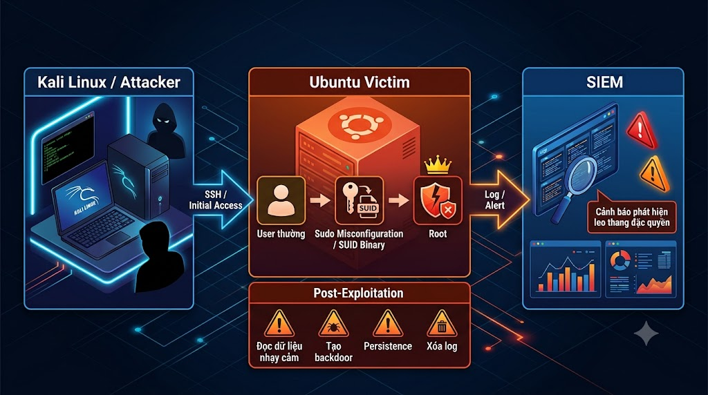
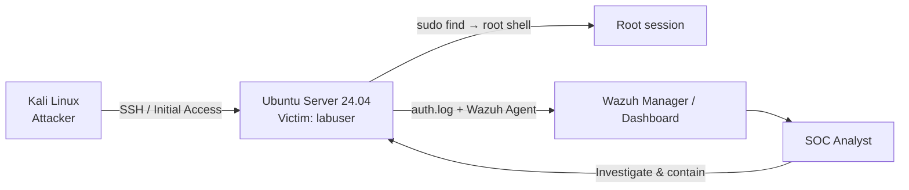
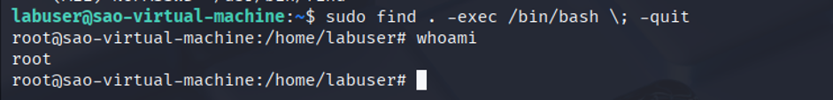
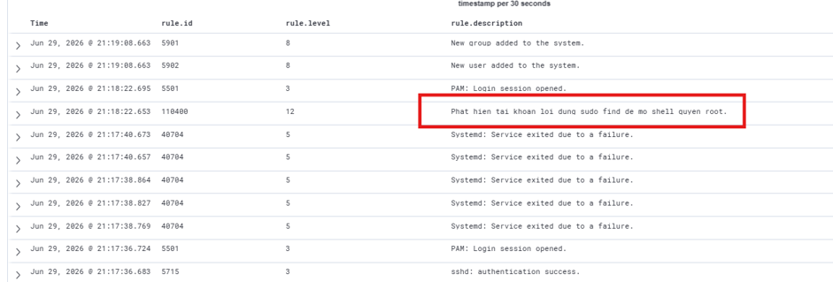

# Lab 1 — Privilege Escalation trên Linux

> 🎥 **Video hướng dẫn:** [Mở tài liệu video Lab 1](Video/README.md)

## Mục tiêu

Mô phỏng một tài khoản người dùng thông thường lợi dụng cấu hình `sudo` sai để mở shell `root`, sau đó tạo hoạt động hậu khai thác. Blue Team phải phát hiện được lệnh leo quyền, phiên PAM đặc quyền và các thay đổi tài khoản.



## Kiến trúc hạ tầng



| Thành phần | Vai trò | Cấu hình tham khảo |
|---|---|---|
| Kali Linux | Máy tấn công | 2 CPU, 2 GB RAM, 50 GB disk |
| Ubuntu Server 24.04 | Máy nạn nhân | SSH, user `labuser`, Wazuh Agent |
| Wazuh | SIEM/XDR | 4 CPU, 6 GB RAM, 100 GB disk |

## Chuẩn bị môi trường

```bash
sudo adduser labuser
sudo systemctl enable --now ssh
```

Cấu hình sai có chủ đích trong `sudoers`:

```text
labuser ALL=(ALL) NOPASSWD: /usr/bin/find
```

> [!WARNING]
> Cấu hình trên tạo lỗ hổng leo thang đặc quyền. Chỉ dùng trong VM lab và phải xóa sau bài thực hành.

## Luồng tấn công

```mermaid
sequenceDiagram
    participant A as Attacker
    participant U as Ubuntu/labuser
    participant R as Root
    participant W as Wazuh
    A->>U: SSH bằng tài khoản labuser
    A->>U: sudo -l
    A->>U: sudo find . -exec /bin/bash \; -quit
    U->>R: Mở shell quyền root
    R->>U: Đọc file nhạy cảm / tạo user backdoor
    U->>W: Gửi auth.log và sự kiện tài khoản
    W-->>A: Không phản hồi; tạo alert cho SOC
```

Lệnh kiểm thử chính:

```bash
ssh labuser@IP_VICTIM
sudo -l
sudo find . -exec /bin/bash \; -quit
whoami
```



## Phát hiện trên Wazuh

| Dấu hiệu | Nguồn log / Rule |
|---|---|
| `sudo` thực thi thành công với quyền root | Rule `5402` |
| Mở/đóng phiên PAM đặc quyền | Rules `5501`, `5502` |
| Tạo user và group mới | Rules `5902`, `5901` |
| `find -exec /bin/bash` mở root shell | Custom Rule `110400`, level 12 |

Custom rule được ánh xạ tới **MITRE ATT&CK T1548.003 — Sudo and Sudo Caching**.



## Điều tra

```bash
grep sudo /var/log/auth.log
grep "session opened" /var/log/auth.log
last -ai
history
awk -F: '$3 == 0 {print $1}' /etc/passwd
```

SOC Analyst cần xác định:

- Tài khoản nguồn, IP SSH và thời điểm đăng nhập.
- Command đã chạy và thời điểm mở phiên `root`.
- User/group mới, cronjob, SSH key, service hoặc file hệ thống bị thay đổi.

## Ứng phó

1. Bảo toàn `auth.log`, cấu hình `sudoers`, process list và network connections.
2. Khóa `labuser`, kết thúc session đang hoạt động và chặn IP nguồn khi phù hợp.
3. Xóa quyền `NOPASSWD` đối với `/usr/bin/find`; kiểm tra bằng `visudo -c`.
4. Xóa tài khoản backdoor sau khi đã thu thập bằng chứng.
5. Rà soát persistence; khôi phục từ snapshot sạch nếu không xác định được toàn bộ thay đổi.
6. Giám sát lại Rule `110400` sau khi đưa máy chủ trở lại hoạt động.

## Kết quả mong đợi

- Red Team mở được shell `root` trong lab.
- Wazuh tạo cảnh báo mức cao cho chuỗi `sudo find → /bin/bash`.
- Blue Team dựng được timeline từ SSH login đến hậu khai thác và hoàn tất containment/eradication.
