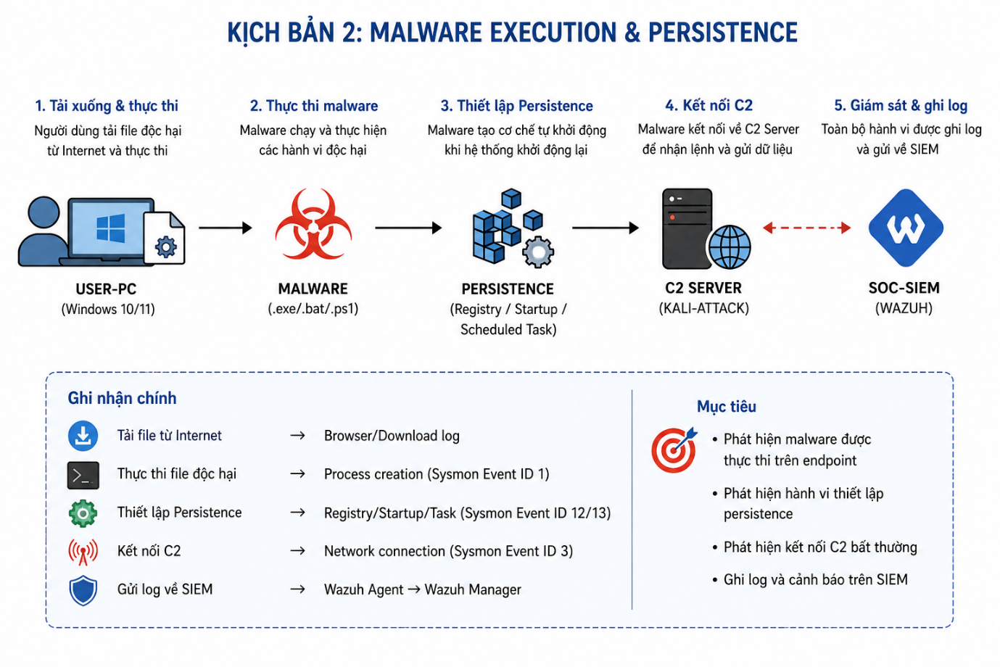
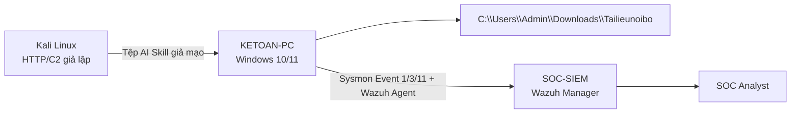
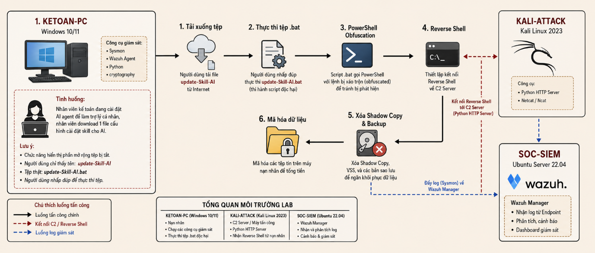
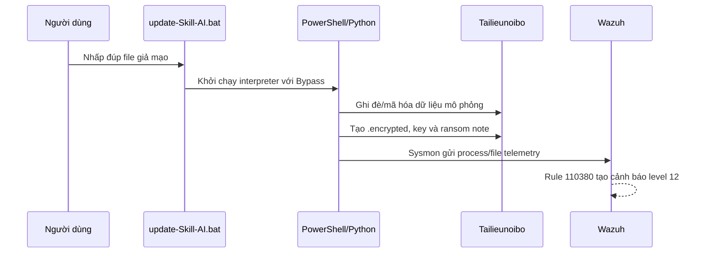
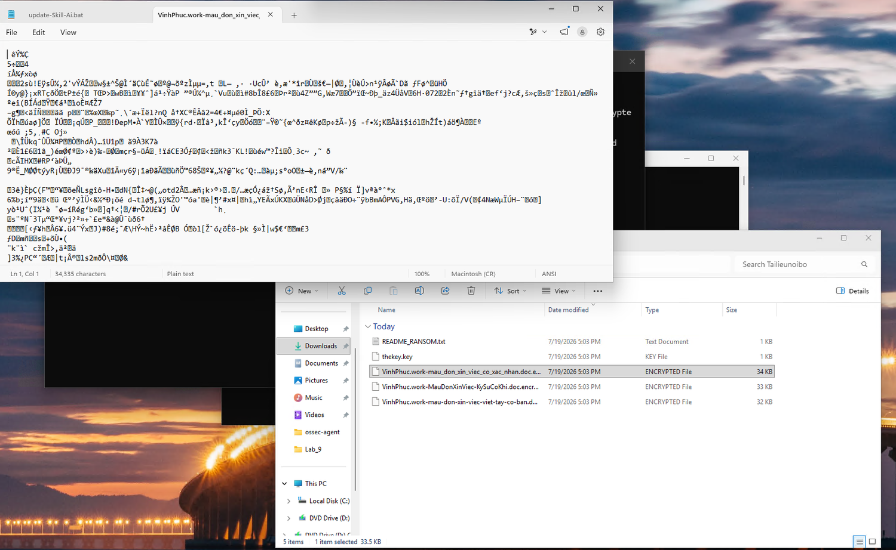
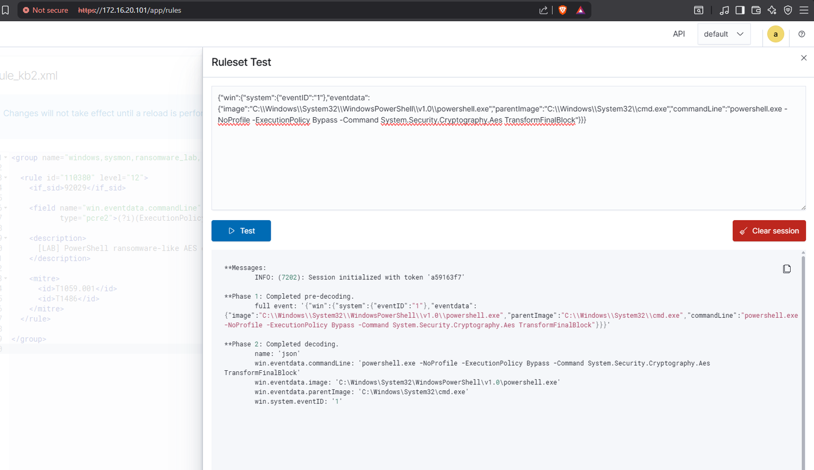

# Lab 2 — AI Skill giả mạo và hành vi Ransomware

> 🎥 **Video hướng dẫn:** [Mở tài liệu video Lab 2](Video/README.md)

## Mục tiêu

Huấn luyện SOC Analyst nhận diện chuỗi thực thi **file `.bat` giả mạo → `cmd.exe`/PowerShell/Python → mã hóa dữ liệu mô phỏng**, đồng thời phát hiện `ExecutionPolicy Bypass`, API mã hóa và file bị đổi đuôi hàng loạt.



## Kiến trúc hạ tầng



| Thành phần | Vai trò | Công cụ |
|---|---|---|
| `KETOAN-PC` | Endpoint nạn nhân | Windows 10/11, Sysmon, Wazuh Agent, Python |
| `KALI-ATTACK` | Máy tấn công/C2 giả lập | Kali Linux, Python HTTP Server |
| `SOC-SIEM` | Hệ thống giám sát | Ubuntu Server 22.04, Wazuh Manager |



## Phạm vi an toàn

Chỉ xử lý dữ liệu giả lập nằm trực tiếp trong:

```text
C:\Users\Admin\Downloads\Tailieunoibo
```

Trước khi chạy:

- Tạo snapshot Windows VM.
- Sao lưu thư mục `Tailieunoibo`.
- Không dùng file cá nhân hoặc thư mục chia sẻ thật.
- Không tắt cơ chế bảo vệ trên máy thật.

## Telemetry cần bật

Sysmon nên thu thập tối thiểu:

- **Event ID 1:** Process Create (`cmd.exe`, `powershell.exe`, `python.exe`).
- **Event ID 3:** Network Connection.
- **Event ID 11:** File Create, đặc biệt `.encrypted`, ransom note và key file.

## Luồng tấn công mô phỏng





## Phát hiện trên SIEM

Dấu hiệu chính:

- Parent/child process bất thường: `cmd.exe → powershell.exe` hoặc `python.exe`.
- `-ExecutionPolicy Bypass`.
- Chuỗi `System.Security.Cryptography.Aes`, `RNGCryptoServiceProvider`, `TransformFinalBlock`.
- Nhiều file `.encrypted` được tạo trong thời gian ngắn.
- Xuất hiện key file và ransom note.

| Rule | Mức | Ý nghĩa |
|---|---:|---|
| `92029` | 6 | PowerShell/Sysmon process telemetry ban đầu |
| `110380` | 12 | PowerShell có đồng thời dấu hiệu bypass và mã hóa dữ liệu |

MITRE ATT&CK: **T1059.001 — PowerShell**, **T1486 — Data Encrypted for Impact**.



## Điều tra Blue Team

1. Xác định user, hostname, parent process và command line.
2. Dựng process tree từ file `.bat` đến PowerShell/Python.
3. Tìm Sysmon Event ID 11 hoặc Wazuh FIM cho file `.encrypted`.
4. Kiểm tra network connection của PowerShell/Python.
5. Thu thập hash của file giả mạo, script trung gian, key file và ransom note.
6. Đối chiếu thời điểm mã hóa với lịch sử tải xuống và hành vi người dùng.

## Ứng phó

- Cô lập endpoint khỏi mạng.
- Dừng process gây mã hóa sau khi bảo toàn bằng chứng cần thiết.
- Chặn URL/IP nguồn phân phối payload.
- Xóa persistence và file độc hại trong môi trường lab.
- Khôi phục thư mục từ snapshot/backup sạch.
- Bật hiển thị phần mở rộng file và tăng cường Application Control.

## Kết quả mong đợi

Wazuh không chỉ ghi nhận PowerShell chung chung mà phải sinh cảnh báo có ngữ cảnh ransomware, giúp SOC phân biệt hoạt động quản trị hợp lệ với chuỗi thực thi nguy hiểm.
