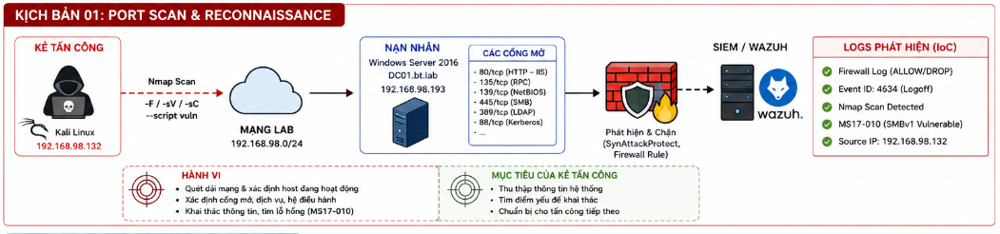
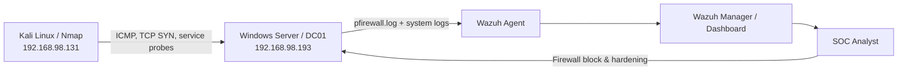
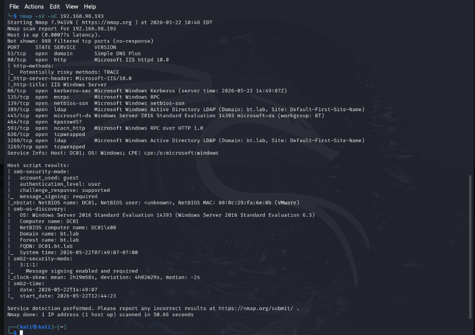
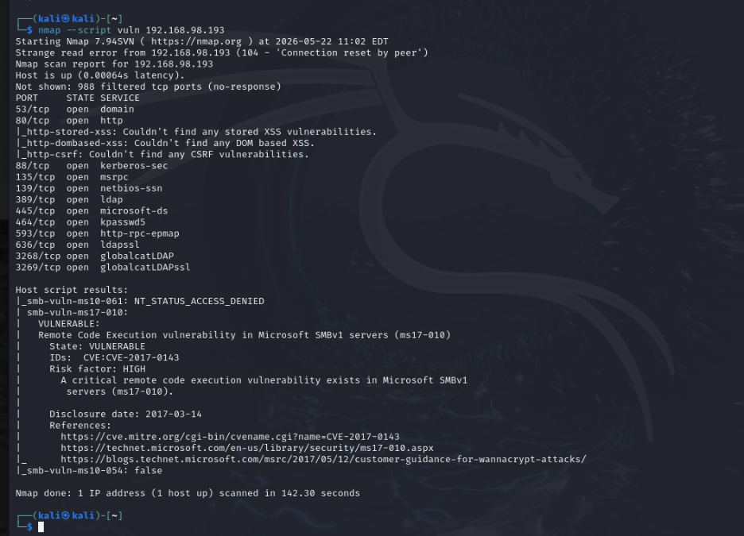
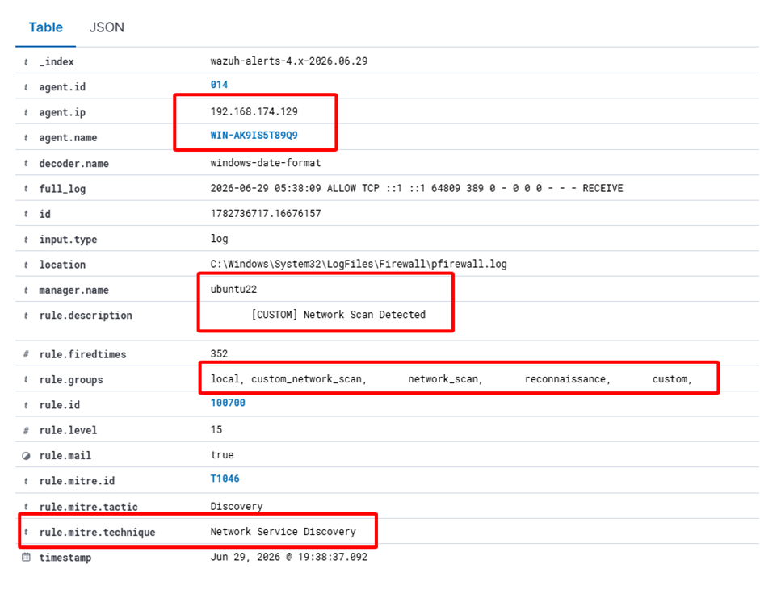
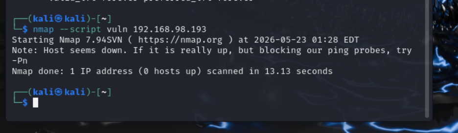

# Lab 6 — Network Scanning & Reconnaissance

> 🎥 **Video hướng dẫn:** [Mở tài liệu video Lab 6](Video/README.md)

## Mục tiêu

Mô phỏng Nmap thực hiện host discovery, port scanning, service/version detection và vulnerability scan. Blue Team sử dụng Windows Firewall log và Wazuh để phát hiện hoạt động reconnaissance, sau đó chặn IP nguồn và harden dịch vụ.



## Kiến trúc hạ tầng



| Thành phần | Vai trò |
|---|---|
| Kali Linux | Scanner/Attacker |
| Windows Server/DC01 | Victim, IIS/SMB/AD services |
| Wazuh | Thu thập Windows Firewall log và tạo alert |

## Chuẩn bị telemetry

Bật Windows Firewall logging và cấu hình Wazuh Agent đọc:

```text
C:\Windows\System32\LogFiles\Firewall\pfirewall.log
```

Đảm bảo agent kết nối Wazuh Manager trước khi quét.

## Các bước reconnaissance

```bash
# Quét nhanh dải mạng
nmap -F 192.168.98.0/24

# Nhận diện service và chạy default scripts
nmap -sV -sC 192.168.98.193

# Kiểm tra lỗ hổng trong lab
nmap --script vuln 192.168.98.193
```



Các dịch vụ quan sát được trong tài liệu lab gồm IIS, SMB và các cổng liên quan Active Directory. Vulnerability scan cho thấy dấu hiệu MS17-010 trên môi trường cố ý để lỗi thời.



> [!CAUTION]
> Không quét dải mạng ngoài phạm vi được cấp phép. Vulnerability scan có thể gây gián đoạn dịch vụ cũ hoặc thiết bị yếu.

## Phát hiện trên Wazuh

Custom Rule `100700`, level 15:

- Match Windows Firewall log có `ALLOW TCP`.
- Group: `network_scan`, `reconnaissance`, `custom`.
- MITRE ATT&CK **T1046 — Network Service Discovery**.



Nên correlation thêm:

- Một source IP kết nối nhiều destination ports trong thời gian ngắn.
- Nhiều host bị thăm dò từ cùng source.
- TCP SYN tăng đột biến, kết nối ngắn và tuần tự.
- Service probes tới 22, 80, 135, 139, 389, 445, 3389.

## Ứng phó

Chặn IP nguồn trong lab:

```powershell
New-NetFirewallRule `
  -DisplayName "Block Attacker" `
  -Direction Inbound `
  -Action Block `
  -RemoteAddress 192.168.98.131
```

Các biện pháp bổ sung:

- Tắt dịch vụ/cổng không cần thiết.
- Vô hiệu hóa SMBv1 và vá MS17-010.
- Chỉ cho phép cổng quản trị từ management VLAN/VPN.
- Giảm phản hồi ICMP khi phù hợp với kiến trúc vận hành.
- Theo dõi firewall log sau containment.



## Điều tra

- Xác định source IP, thời gian, số lượng port/host bị quét.
- Kiểm tra có khai thác hoặc đăng nhập xảy ra sau reconnaissance không.
- Đối chiếu asset inventory để xác định dịch vụ lộ không mong muốn.
- Rà soát lỗ hổng và cấu hình legacy, đặc biệt SMBv1.

## Kết quả mong đợi

Wazuh phát hiện hoạt động quét và tạo alert reconnaissance; sau khi firewall block/hardening, Nmap nhận timeout hoặc kết quả bị giới hạn và không thể tiếp tục thu thập banner như trước.
