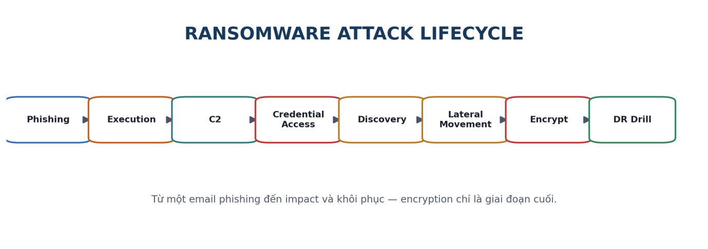
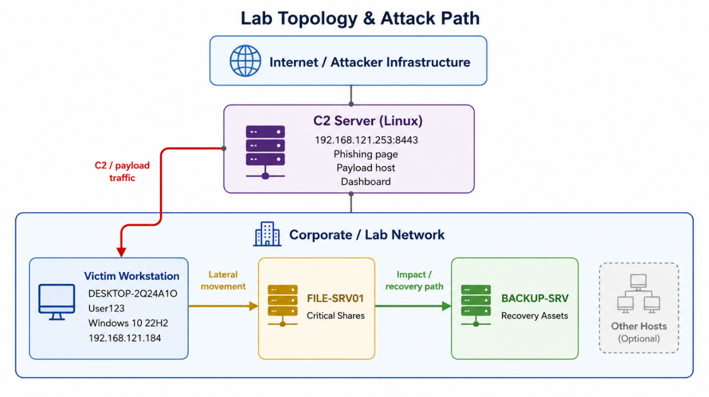
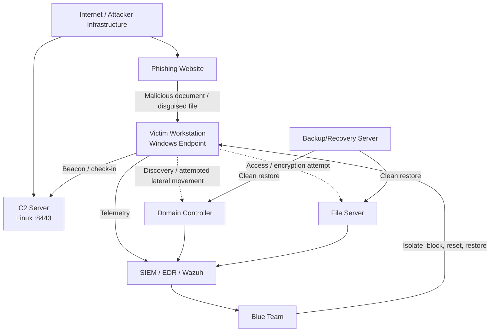
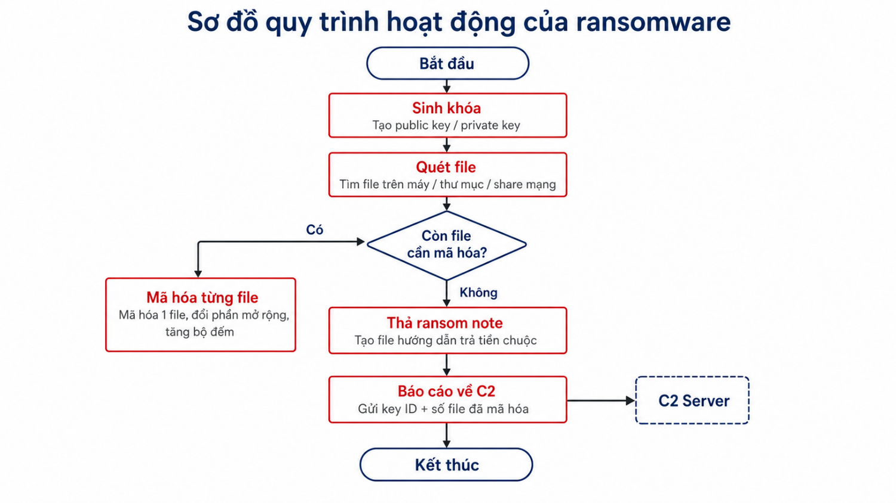
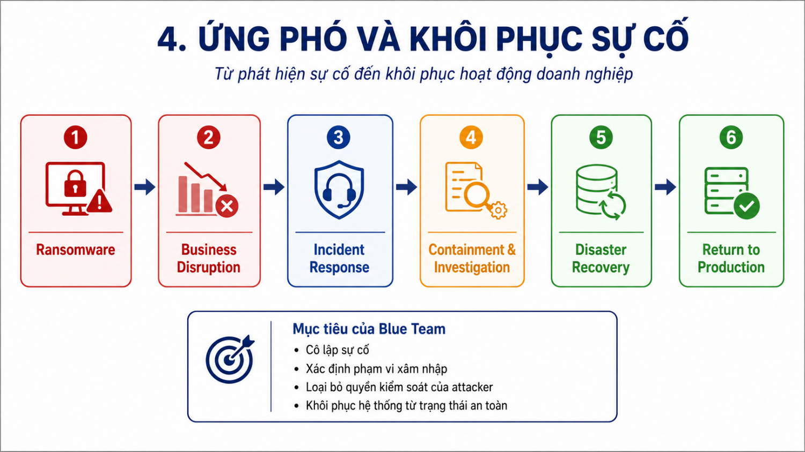
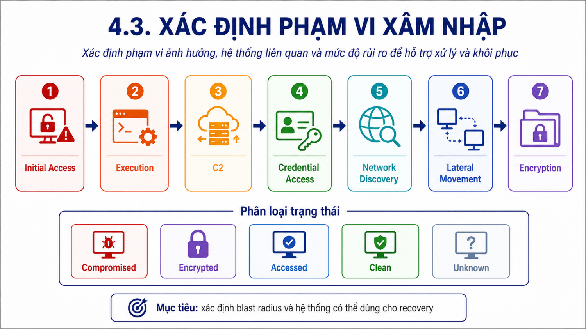
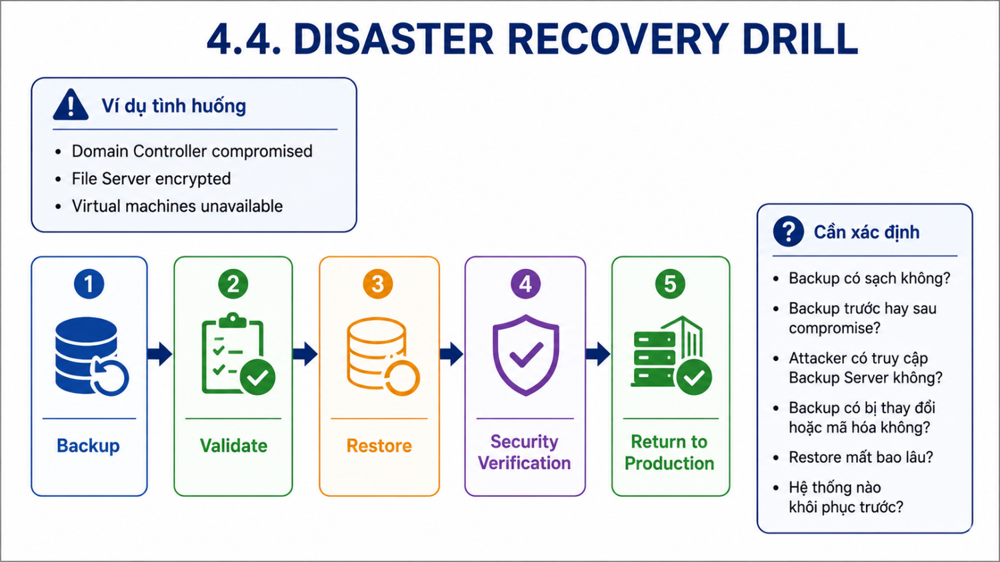
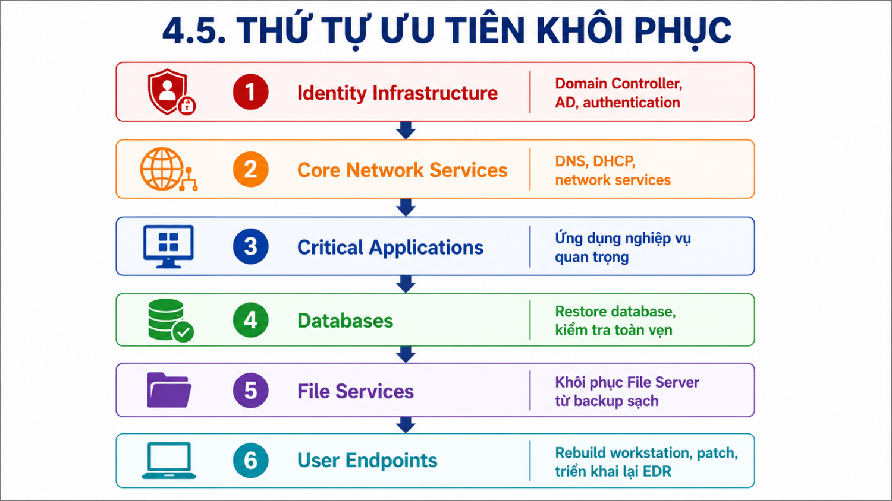

# Lab 8 — Attack–Defense: Ransomware qua Phishing Email

> 🎥 **Video hướng dẫn:** [Mở tài liệu video Lab 8](Video/README.md)

## Tổng quan

Bài lab Purple Team mô phỏng chuỗi **phishing → execution → C2 → credential access/discovery → lateral movement → ransomware impact → Incident Response → Disaster Recovery Drill**.

> [!CAUTION]
> Đây là bài diễn tập có mức rủi ro cao. Chỉ dùng payload mô phỏng, dữ liệu giả và mạng hoàn toàn cô lập. Luôn tạo snapshot, ngắt shared folder thật và kiểm tra đường dẫn mã hóa trước khi chạy.

## Bối cảnh doanh nghiệp giả lập

- Khoảng 200 nhân viên.
- 1 Domain Controller, 2 File Server và khoảng 50 workstation Windows 10.
- Phòng Kế toán thường xử lý chứng từ thanh toán qua email.
- Nạn nhân nhận email khẩn yêu cầu tải và ký duyệt chứng từ.

## Kiến trúc hạ tầng

## Chuỗi tấn công

| Giai đoạn | Mô tả | Điểm quan sát phòng thủ |
|---|---|---|
| Initial Access | Email phishing giả mạo chứng từ thanh toán | Mail gateway, URL click, file download |
| Execution | File giả mạo kích hoạt PowerShell/macro | Process tree, command line, script block log |
| Command & Control | Endpoint check-in C2 qua `:8443` | DNS/proxy/firewall/EDR network telemetry |
| Discovery | Thu thập host, user, IP, AV | PowerShell, WMI, `net`, system discovery events |
| Credential Access | Tìm credential có giá trị | LSASS access, credential dumping indicators |
| Lateral Movement | Thử truy cập File Server/AD | SMB, WinRM, WMI, failed/success logon |
| Impact | Mã hóa file và tạo ransom note | File entropy, rename burst, extension `.ENCRYPTED` |

## Ma trận tấn công – phòng thủ

| Giai đoạn | Hoạt động mô phỏng của Red Team | Dữ liệu Blue Team cần quan sát | Hành động phòng thủ |
|---|---|---|---|
| Initial Access | Email/link và tài liệu giả mạo | Mail log, URL click, file download | Cô lập email, chặn URL/hash |
| Execution | Macro/script gọi PowerShell ẩn | Process tree, command line, Script Block | Kill process, cách ly endpoint |
| C2 | Endpoint check-in tới server `:8443` | DNS, proxy, firewall, Sysmon Event 3 | Chặn IP/domain/port C2 |
| Discovery | Thu thập host, user, IP và AV | Process/command telemetry | Hunt trên các endpoint liên quan |
| Credential Access | Truy cập credential hoặc token | LSASS access, logon bất thường | Reset credential, thu hồi session |
| Lateral Movement | SMB/WinRM/WMI tới server nội bộ | 4624/4625, SMB, service creation | Chặn east-west traffic, disable account |
| Impact | Đổi đuôi file và tạo ransom note | File-create/rename burst, FIM/EDR | Cô lập, bảo toàn bằng chứng, phục hồi |

## Góc nhìn Red Team

Mục tiêu của Red Team là kiểm tra mức độ quan sát và phản ứng của hệ thống ở từng giai đoạn, không chỉ chứng minh rằng payload có thể chạy. Mỗi hành động phải được ghi thời gian, hostname, user, source/destination IP và kết quả.

## Góc nhìn Blue Team

### 1. Phát hiện và tuyên bố sự cố

Kích hoạt Incident Response khi xuất hiện một hoặc nhiều dấu hiệu:

- File bị đổi đuôi hàng loạt hoặc ransom note.
- PowerShell/macro/process tree bất thường.
- Beacon tới C2.
- Credential access hoặc lateral movement.
- File Server có hoạt động ghi/xóa tăng đột biến.

### 2. Cô lập hệ thống

- Cô lập endpoint bị nhiễm.
- Chặn IP/domain C2.
- Disable tài khoản nghi bị compromise.
- Hạn chế SMB, WinRM và WMI bất thường.
- Bảo quản log, memory và các artifact quan trọng.

### 3. Xác định phạm vi xâm nhập

Phân loại từng tài sản thành:

- `Compromised`
- `Encrypted`
- `Accessed`
- `Clean`
- `Unknown`

### 4. Disaster Recovery Drill

Quy trình khôi phục cần bao gồm:

1. Xác minh backup sạch và không chứa persistence.
2. Restore trong vùng mạng cách ly.
3. Security validation trước khi kết nối lại.
4. Theo dõi tăng cường sau khi đưa dịch vụ trở lại.

### 5. Thứ tự ưu tiên khôi phục

1. Identity Infrastructure — Domain Controller, AD, authentication.
2. Core Network Services — DNS, DHCP.
3. Critical Applications.
4. Databases.
5. File Services.
6. User Endpoints.

## Kiểm tra trước khi trở lại production

- Không còn kết nối C2.
- Không còn persistence đáng ngờ.
- Tài khoản bị compromise đã reset/thu hồi session.
- EDR/SIEM hoạt động và logging đầy đủ.
- Backup đã được xác minh.
- Dịch vụ quan trọng hoạt động bình thường.
- Có phê duyệt của Incident Commander/System Owner.

## Kết quả mong đợi

- Red Team chứng minh được attack path trong phạm vi lab.
- Blue Team phát hiện được nhiều giai đoạn, không chỉ giai đoạn mã hóa cuối.
- Tổ chức xác định được blast radius, cô lập đúng tài sản và khôi phục theo thứ tự ưu tiên.
- Báo cáo cuối bài có timeline, bằng chứng, gaps và action items.

## Video thực hành

Video của bài diễn tập được khai báo tại [Video/README.md](Video/README.md). Tài liệu triển khai máy chủ C2 nằm tại [ServerC2/README.md](ServerC2/README.md).
