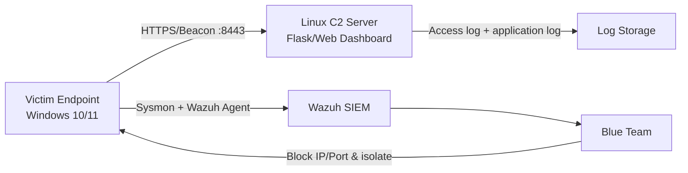
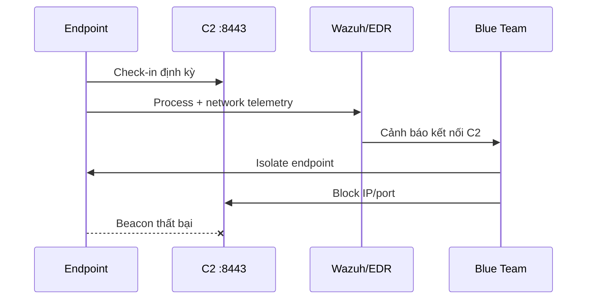

# Server C2 — Tài liệu triển khai cho Lab 8

## Mục đích

Máy chủ C2 trong bài diễn tập chỉ dùng để **nhận check-in và dữ liệu mô phỏng** từ endpoint trong mạng lab. Không triển khai máy chủ này trên Internet và không sử dụng để điều khiển hệ thống không thuộc phạm vi được cấp phép.

## Kiến trúc



| Thành phần | Giá trị tham khảo |
|---|---|
| Hệ điều hành | Ubuntu/Kali Linux trong VM cô lập |
| Cổng ứng dụng | `8443/TCP` |
| Giao thức | HTTPS hoặc HTTP chỉ trong mạng lab |
| Endpoint mẫu trong tài liệu | `192.168.121.187` |
| C2 mẫu trong tài liệu | `192.168.121.253:8443` |
| Log cần giữ | Access log, check-in time, hostname, user, source IP |

## Chuẩn bị an toàn

1. Tạo snapshot cho máy C2 và endpoint.
2. Chuyển các VM vào Host-only/Internal Network.
3. Không cấu hình port forwarding từ router hoặc public cloud.
4. Chỉ cho phép IP của endpoint lab kết nối tới `8443/TCP`.
5. Đồng bộ thời gian giữa C2, endpoint và Wazuh.

## Cài đặt ứng dụng C2 mẫu

Các lệnh dưới đây là khung triển khai chung; thay URL và lệnh chạy theo repository C2 mà bạn sử dụng:

```bash
sudo apt update
sudo apt install -y git python3 python3-venv

git clone <URL_REPOSITORY_C2>
cd <THU_MUC_REPOSITORY>

python3 -m venv .venv
source .venv/bin/activate
pip install --upgrade pip
pip install -r requirements.txt
```

Tạo file cấu hình môi trường nếu repository hỗ trợ:

```bash
cp .env.example .env
nano .env
```

Các biến nên cấu hình:

```text
C2_BIND_HOST=0.0.0.0
C2_PORT=8443
C2_LOG_LEVEL=INFO
C2_DATA_DIR=./data
```

Khởi chạy theo hướng dẫn của repository, ví dụ:

```bash
python3 app.py
```

## Kiểm tra dịch vụ

```bash
ss -lntp | grep 8443
curl -k https://127.0.0.1:8443/
```

Giới hạn firewall chỉ cho subnet lab:

```bash
sudo ufw default deny incoming
sudo ufw allow from 192.168.121.0/24 to any port 8443 proto tcp
sudo ufw enable
```

## Dữ liệu cần quan sát

- Thời điểm endpoint check-in.
- Hostname, username và địa chỉ IP nguồn.
- Tần suất beacon.
- User-Agent hoặc URI bất thường.
- Lệnh/phase mô phỏng đang được thực hiện.
- Kết nối bị ngắt sau khi Blue Team containment.

## Điểm phát hiện Blue Team



Blue Team nên đối chiếu timestamp giữa access log của C2 và Sysmon Event ID 3/EDR network telemetry trên endpoint để xác nhận nguồn tiến trình, IP đích và thời điểm containment có hiệu lực.

## Thu dọn sau bài lab

```bash
# Dừng ứng dụng C2
pkill -f 'python3 app.py'

# Kiểm tra không còn port lắng nghe
ss -lntp | grep 8443
```

Sau khi xuất log và tạo mã băm bằng chứng, khôi phục snapshot hoặc xóa toàn bộ dữ liệu check-in mô phỏng.
