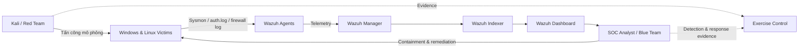

# Blue Team & Purple Team Portfolio

Bộ bài thực hành SOC, Threat Hunting, Detection Engineering và Incident Response sử dụng **Wazuh**, **Sysmon**, Windows/Linux endpoint và Kali Linux.

> [!CAUTION]
> Chỉ chạy các kịch bản trong mạng lab cô lập và trên tài sản được cấp phép. Tạo snapshot trước khi thử nghiệm và không sử dụng dữ liệu thật.

## Danh sách bài lab

| Thư mục | Chủ đề | Tài liệu | Video |
|---|---|---|---|
| `Lab1` | Privilege Escalation trên Linux | [README](Lab1/README.md) | [Video](Lab1/Video/README.md) |
| `Lab2` | AI Skill giả mạo và ransomware mô phỏng | [README](Lab2/README.md) | [Video](Lab2/Video/README.md) |
| `Lab3` | Insider Threat đánh cắp dữ liệu nội bộ | [README](Lab3/README.md) | [Video](Lab3/Video/README.md) |
| `Lab4` | Brute-force SSH/RDP | [README](Lab4/README.md) | [Video](Lab4/Video/README.md) |
| `Lab5` | Reverse Shell và duy trì truy cập | [README](Lab5/README.md) | [Video](Lab5/Video/README.md) |
| `Lab6` | Network Scanning & Reconnaissance | [README](Lab6/README.md) | [Video](Lab6/Video/README.md) |
| `Lab8` | Attack–Defense: Ransomware qua phishing | [README](Lab8/README.md) | [Video](Lab8/Video/README.md) |
| `Lab8/ServerC2` | Tài liệu hạ tầng C2 cho bài Attack–Defense | [README](Lab8/ServerC2/README.md) | — |

## Kiến trúc tổng thể



## Cấu trúc repository

```text
Lab_BlueTeam/
├── README.md
├── Lab1/
│   ├── README.md
│   ├── assets/
│   └── Video/README.md
├── Lab2/
│   ├── README.md
│   ├── assets/
│   └── Video/README.md
├── Lab3/
├── Lab4/
├── Lab5/
├── Lab6/
└── Lab8/
    ├── README.md
    ├── assets/
    ├── ServerC2/README.md
    └── Video/README.md
```

Thư mục `assets/` chứa hình kiến trúc, ảnh kết quả tấn công mô phỏng và ảnh cảnh báo SIEM được trích từ tài liệu gốc.

## Quy ước thực hành

- Đồng bộ timezone và NTP giữa tất cả VM.
- Ghi lại hostname, IP, user và timestamp của từng hành động.
- Tạo dữ liệu mồi thay vì dùng tài liệu doanh nghiệp thật.
- Bảo toàn log trước khi containment hoặc xóa artifact.
- Sau bài lab, rollback snapshot và xác nhận không còn service/payload tạm thời.

## Nguồn nội dung

README được biên tập từ tài liệu **“Bộ kịch bản diễn tập SOC thực chiến và Threat Hunting”**. Hình ảnh trong `assets/` được sử dụng lại từ tài liệu này.
